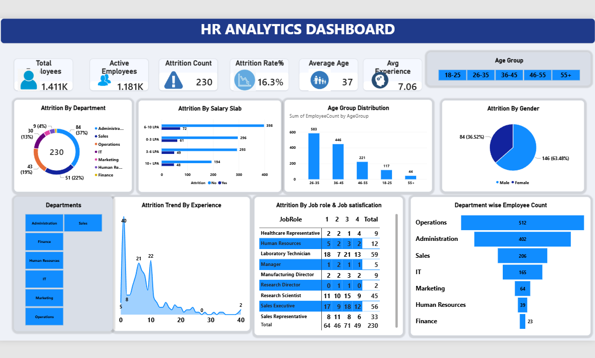
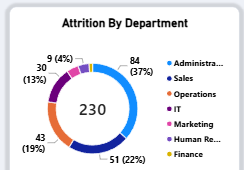
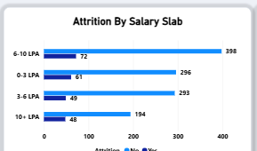
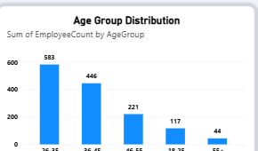
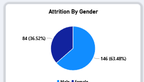
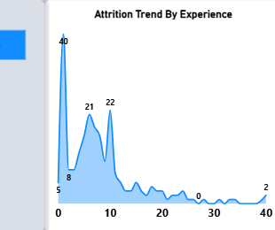
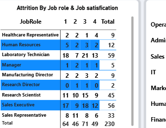
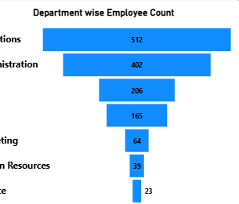

# 👥 HR Analytics Dashboard — Attrition Study

An HR attrition analysis built entirely around one Power BI dashboard. Every question below is answered using **the dashboard's own panels** — no extra charts were built for this project; the visuals here are the dashboard itself.



---

## 📖 The Story

HR just pulled a workforce report: **1,480 employee records**, and they want to know one thing — *why are people leaving, and where should retention efforts focus first?*

Instead of exporting the data into fresh notebooks and building yet another set of charts, this project takes the opposite approach: the Power BI dashboard already asks eight good questions across its panels. The job here was to actually *answer* them properly, using the same numbers the dashboard is built on, and turn each panel into a real finding instead of just a pretty picture.

---

## 🗂️ Dataset

**File:** `data/HR_Analytics-4__2_.csv` — 1,480 employee records, 37 columns covering demographics, department, salary, satisfaction scores, tenure, and attrition status.

**Key fields used:** `Attrition`, `Department`, `SalarySlab`, `AgeGroup`, `Gender`, `TotalExperience(Years)`, `YearsatCompany`, `JobRole`, `JobSatisfaction`.

---

## ❓ Questions Pulled Straight From the Dashboard's Panels

### Q1. What do the headline KPI cards say about the workforce overall?
Total Employees **1.411K**, Active Employees **1.181K**, Attrition Count **230**, Attrition Rate **16.3%**, Average Age **37**, Average Experience **7.06 years**. That last figure is worth flagging: it's the average **years at the company**, not total career experience — a distinction worth keeping straight when this dashboard gets handed to someone else.


### Q2. Which department loses the most people — in absolute numbers and as a share of its own headcount?
**Administration** has both the highest headcount among leavers (37% of all attrition, ~84 people) and, cross-referenced against its department size (425 employees), that's roughly a **1-in-5 attrition rate** — worse than it first looks buried inside a raw count.


### Q3. Does paying people more actually reduce attrition?
Not in a straight line. The **6-10 LPA** salary slab has the *highest* attrition count (76 leavers) of any band — even more than the lowest **0-3 LPA** slab (65 leavers). Mid-level pay isn't buying loyalty here; something else (role, workload, growth ceiling) is likely driving departures in that band.


### Q4. Which age group makes up the bulk of the workforce, and does that match where attrition concentrates?
**26-35 year-olds** are by far the largest segment (583 people, ~40% of the company) — this is also the group most exposed to attrition risk simply by weight of numbers, meaning any retention program should be built with this age band in mind first.


### Q5. Is attrition split evenly between men and women?
No — it skews notably toward one side: **146 (63.5%)** of leavers vs **84 (36.5%)**. Given men make up roughly 60% of the overall workforce, this gap is bigger than headcount alone explains and is worth a deeper look at whether it's role-specific or department-specific.


### Q6. At what career stage do people actually leave?
The trend line makes this one obvious: attrition **spikes hardest at the very start of a career** (the sharp peak near 0-2 years of experience), dips, has a second smaller bump around the 6-10 year mark, then tapers into a long thin tail. Early-tenure churn is clearly the dominant pattern, not late-career burnout.


### Q7. Which specific job roles are the highest attrition risk, and does satisfaction explain it?
**Laboratory Technician (59 leavers)** and **Sales Executive (56 leavers)** are the two biggest attrition sources by role — together over **47%** of all attrition. But the satisfaction breakdown complicates the easy story: for Laboratory Technicians, 20 of the 59 leavers rated satisfaction level 1 (lowest) — the largest single cell in the whole table — while for Sales Executives, satisfaction is actually spread fairly evenly across all four levels, meaning **low satisfaction explains lab tech attrition far better than it explains sales attrition.**


### Q8. Which departments carry the most headcount, and are they the same departments driving attrition?
**Operations (512)** and **Administration (402)** are by far the biggest departments. Operations is the biggest department overall but is *not* the top source of attrition (Q2 showed Administration leads there) — meaning Operations is comparatively stable relative to its size, while Administration is both large *and* disproportionately leaky.


---

## 🔑 Key Takeaways

1. **Administration is the retention priority** — largest attrition share *and* a high attrition rate relative to its own headcount, unlike Operations which is large but comparatively stable.
2. **Early tenure is the danger zone** — most people who leave do so within their first 1-2 years, not after a decade of experience.
3. **Mid-salary (6-10 LPA) attrition is a red flag** — money alone isn't retaining this band, so the driver is more likely role scope, management, or growth prospects.
4. **Job satisfaction explains attrition unevenly by role** — it's a strong driver for Laboratory Technicians, but a weak one for Sales Executives, so a one-size-fits-all retention fix won't work across roles.
5. **The gender gap in attrition (63.5% vs 36.5%) is worth investigating further** — it's larger than the overall workforce gender split would predict on its own.

---

## 📁 Repo Structure

```
hr-analytics-dashboard/
├── README.md
├── dashboard/
│   ├── HR.pbix                     # Power BI dashboard file
│   ├── dashboard_full.png          # Full dashboard screenshot
│   └── crops/                      # Individual panels, cropped from the dashboard
├── analysis/
│   └── verify_dashboard_numbers.py # Reproduces every number quoted above — no new charts
└── data/
    └── HR_Analytics-4__2_.csv
```

## ▶️ How to Verify the Numbers

```bash
pip install pandas
cd analysis
python verify_dashboard_numbers.py
```

This prints the exact counts and percentages behind every answer above, straight from the raw CSV — no new visuals, since the dashboard itself is the visual layer for this project.

---

## 👤 Author

**Mudasir Ahmed** — IT student, University of Sindh — building a data analytics portfolio for freelancing.
GitHub: [Mudasirahmed31](https://github.com/Mudasirahmed31)
